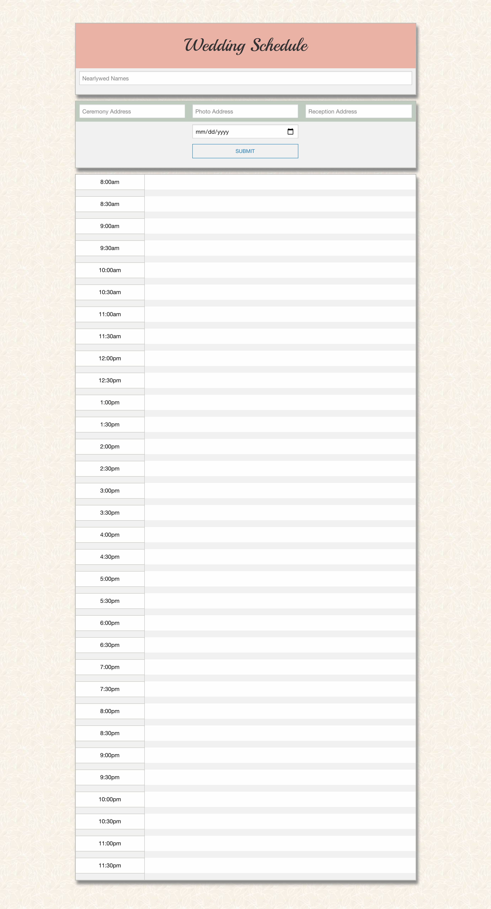
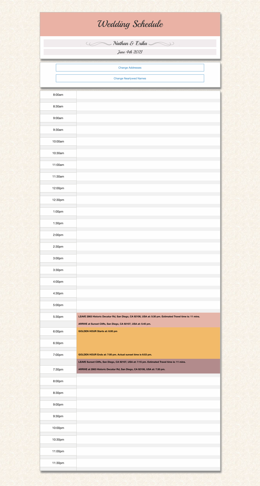

# Golden Hour Wedding Scheduler #
Create the ideal wedding day schedule by prioritizing golden hour and dynamically generating a color-coded schedule. When the user enters the date of the event, the ceremony location, the photo shoot location, and the reception destination, the app calculates and displays: 

* The travel time from the ceremony to the photo shoot location;
* Golden hour; and
* The travel time from the photo shoot location to the reception location. 

## Motivation ##

Wedding industry professionals trying to craft the perfect wedding day schedule will find this app useful because it automates the calculation of golden hour, and the travel time to get to the photo shoot location. The rest of the day's events can be scheduled around golden hour. 

## Description ##

The app uses the following APIs:
* [Google Places API](https://developers.google.com/places/web-service/autocomplete). This API autocompletes the user-entered location on the submission form.
* The [Open Weather API](https://openweathermap.org/api) obtains the longitude and latitude of the photo shoot location. 
* [Sunrise-Sunset API](https://sunrise-sunset.org/api) uses the latitude and longitude generated by the open weather API to return the sunset time. Golden hour is calculated from one hour before the sun sets, and ends at sunset.  
* [Google Distance Matrix API](https://developers.google.com/maps/documentation/distance-matrix/start) is called for the travel time between the ceremony location, photo shoot location, and reception location.  

See images below for screenshots of the app, and [here](https://mbubel.github.io/projectwedding/) is a link to use the app.

## Reference Images
Page on Initial Load:  

Page after user enters info in all submission fields:  

## License
MIT License
Copyright (c) 2020 Michael Bubel, Erika Cueva, Anastasia Ivanshchenko, and Amanda LeMoine
Permission is hereby granted, free of charge, to any person obtaining a copy
of this software and associated documentation files (the "Software"), to deal
in the Software without restriction, including without limitation the rights
to use, copy, modify, merge, publish, distribute, sublicense, and/or sell
copies of the Software, and to permit persons to whom the Software is
furnished to do so, subject to the following conditions:
The above copyright notice and this permission notice shall be included in all
copies or substantial portions of the Software.
THE SOFTWARE IS PROVIDED "AS IS", WITHOUT WARRANTY OF ANY KIND, EXPRESS OR
IMPLIED, INCLUDING BUT NOT LIMITED TO THE WARRANTIES OF MERCHANTABILITY,
FITNESS FOR A PARTICULAR PURPOSE AND NONINFRINGEMENT. IN NO EVENT SHALL THE
AUTHORS OR COPYRIGHT HOLDERS BE LIABLE FOR ANY CLAIM, DAMAGES OR OTHER
LIABILITY, WHETHER IN AN ACTION OF CONTRACT, TORT OR OTHERWISE, ARISING FROM,
OUT OF OR IN CONNECTION WITH THE SOFTWARE OR THE USE OR OTHER DEALINGS IN THE
SOFTWARE.
